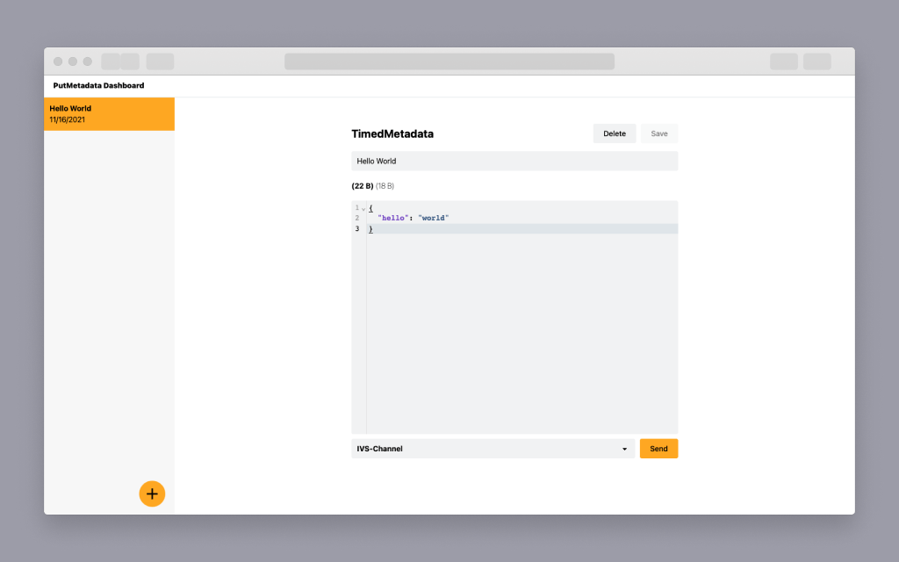

# Amazon IVS PutMetaData Dashboard demo

A demo web application intended as an educational tool to demonstrate how to implement and use a PutMetadata dashboard to send TimedMetadata JSON payloads to Amazon IVS channels.

**This project is intended for education purposes only and not for production usage.**

This is a serverless web application, leveraging [Amazon IVS](https://aws.amazon.com/ivs/), [AWS Lambda](https://aws.amazon.com/lambda/), [API Gateway](https://aws.amazon.com/api-gateway/) and [DynamoDB](https://aws.amazon.com/dynamodb/). The client application is a javascript webapp built on [reactjs](https://reactjs.org/).

This demo is intended to help Amazon IVS customers send JSON [TimedMetadata](https://docs.aws.amazon.com/ivs/latest/userguide/metadata.html#metadata-what-is) to their live channels. Data is sent using the [PutMetadata API](https://docs.aws.amazon.com/ivs/latest/APIReference/API_PutMetadata.html), which inserts the data into a video stream.

TimedMetadata is useful because it is synchronized with the audio and video frames. During playback, all viewers of the stream receive the data at the same time relative to the stream. The timecode serves as a cue point, which can be used to trigger an action based on the data, such as:
- Updating player statistics for a sports stream.
- Sending product details for a [live shopping stream](https://ecommerce.ivsdemos.com).
- Sending questions for a [live quiz stream](https://codepen.io/amazon-ivs/full/XWmjEKN).

## Getting Started

***IMPORTANT NOTE:** Deploying this demo application in your AWS account will create and consume AWS resources, which will cost money.*

This demo is comprised of two parts: `serverless` (the demo backend) and `web-ui` (the demo frontend).

1. If you do not have an AWS account, create one by following this guide: [How do I create and activate a new Amazon Web Services account?](https://aws.amazon.com/premiumsupport/knowledge-center/create-and-activate-aws-account/)
2. Log into the [AWS console](https://console.aws.amazon.com/) if you are not already logged in. Note: If you are logged in as an IAM user, ensure your account has permissions to create and manage the necessary resources and components for this application.
3. Deploy the [serverless app](./serverless/README.md) to your AWS account.

## Known issues and limitations
* The application was written for demonstration purposes and not for production use.
* Currently only tested in the us-west-2 (Oregon) region. Additional regions may be supported depending on service availability.

## About Amazon IVS
Amazon Interactive Video Service (Amazon IVS) is a managed live streaming solution that is quick and easy to set up, and ideal for creating interactive video experiences. [Learn more](https://aws.amazon.com/ivs/).

* [Amazon IVS docs](https://docs.aws.amazon.com/ivs/)
* [User Guide](https://docs.aws.amazon.com/ivs/latest/userguide/)
* [API Reference](https://docs.aws.amazon.com/ivs/latest/APIReference/)
* [Setting Up for Streaming with Amazon Interactive Video Service](https://aws.amazon.com/blogs/media/setting-up-for-streaming-with-amazon-ivs/)

## Security

See [CONTRIBUTING](CONTRIBUTING.md#security-issue-notifications) for more information.

## License

This library is licensed under the MIT-0 License. See the LICENSE file.
